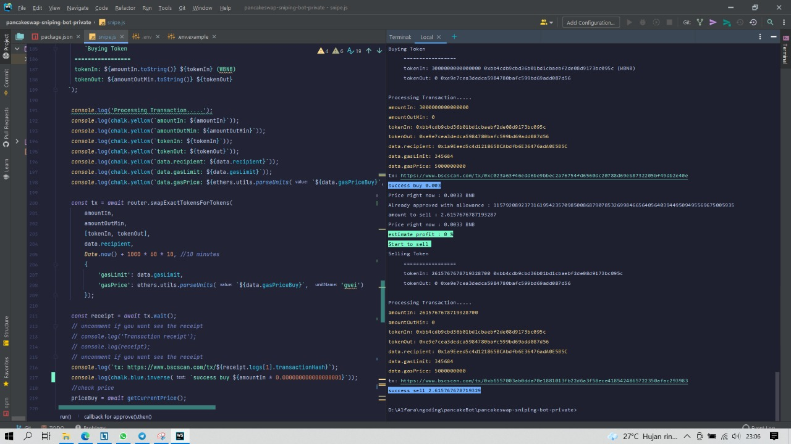

# Table of contents
* [Important Notes](#IMPORTANT-NOTES-BEFORE-RUNNING-THE-BOT)
* [Setup](#HOW-TO-RUN)
* [Troubleshot](#TROUBLESHOT)

## IMPORTANT NOTES BEFORE RUNNING THE BOT
All this bot feature still updating, for first time please test with low balance. But I have been tested for many times, and all feature doing so good.
If you sell again this bot, that mean you will give more people to buy early token easily!

## HOW TO RUN
1. clone this repository
2. $ npm install
3. copy your <code>.env.example</code> to <code>.env</code>
4. set up your <code>.env</code> to with this explanation :

```
WBNB_CONTRACT=0xbb4cdb9cbd36b01bd1cbaebf2de08d9173bc095c
~ WBNB contract for buy the token

FACTORY=0xcA143Ce32Fe78f1f7019d7d551a6402fC5350c73
~ Pancake Factory contract to get function of buy

ROUTER=0x10ED43C718714eb63d5aA57B78B54704E256024E
~ Pancake Factory contract to process function of buy

YOUR_ADDRESS=
~ Your BSC (BEP20) address from trustwallet or another wallet.

SLIPPAGE_BUY=1
~ Customize your slippage here, cannot decimal. (eg : 1, 5, 10). if you buy early token recommended 30+ Slippage

SLIPPAGE_SELL=1
~ Customize your slippage for sell method here, cannot decimal. (eg : 1, 5, 10).

GWEI_SELL=5
~ Customize your GWEI (gas fee) for sell method here, cannot decimal. (eg : 5, 10, 25).

GWEI_BUY=5
~ Customize your GWEI (gas fee) here, cannot decimal. (eg : 5, 10, 25). if you buy early token recommended 15+ GWEI

GAS_LIMIT=345684
~ Minimul limit is 210000, more much more better.

MIN_LIQUIDITY_ADDED=3
~ Set how much minimum liquidity added in pair address that you want to buy. set in BNB. (eg : 2, 4, 7).
  2 mean 2 BNB liquidity added.

YOUR_MNEMONIC=
~ Input your private Key here, that you get from your wallet privacy.

INCREASE_PRICE=20
~ Provide in percent, that mean you will sell the token if price icrease 20%.

AMOUNT_OF_SELL=50
~ Provide in percent, that mean you will sell 50% amount of token you have.

ATTEMPTS=1
~ How many attempts to try again if tx error.


```
5. run with <code>npm run snipe</code>.

6. Wait the bot do his job, if success, you will see like this picture. <br>
   

7. Close bot with <code>ctrl + C</code>.

## TROUBLESHOT
$ If you meet some problems or error, you can contact me or open issues, all of you problem I will recap here.
